<h1 align="center">Matthew Redín</h1>
<h3 align="center">Software Engineering · Escuela Politécnica Nacional</h3>

  

  <strong>Software · Artificial Intelligence · Data · Security</strong> 
  <em>Building systems with solid foundations and real purpose</em>

  

  

---

## 👋 About Me

I'm **Matthew Redín**, a **Software Engineering** student at **Escuela Politécnica Nacional (EPN)**.

I focus on **designing and building well-structured systems**, prioritizing clarity, consistent logic, and long-term sustainability.
I care not only about how something works, but about **why it's designed that way**.

I actively explore **Artificial Intelligence**, **Data Science**, and **Cybersecurity**, strengthening the fundamentals before specializing.

🧪 I'm part of the **LASINAC Research Laboratory**, where I connect academic theory with real technical implementation.

🛡️ Member of **CYBERMINDS**, EPN's student cybersecurity cell (CTFs, courses, and projects), with the vision of becoming a leading knowledge network in cybersecurity among professionals and students.

---

## 🎯 Currently Working On

- Deepening my knowledge of **systems design and architecture**
- Applying **AI and data analysis** to practical problems
- Strengthening fundamentals in **data structures and security**
- Improving code quality, maintainability, and clarity

---

## 🛠️ Tech Stack

<table align="center">
  <tr>
    <td align="center"><strong>Languages</strong></td>
    <td align="center">
      
    </td>
  </tr>
  <tr>
    <td align="center"><strong>Data & Databases</strong></td>
    <td align="center">
      
      
    </td>
  </tr>
  <tr>
    <td align="center"><strong>Tools & Environment</strong></td>
    <td align="center">
       
      
      
    </td>
  </tr>
</table>

---

## 🚀 Featured Projects

### 🏥 Medical Appointment Management System
System developed for a medical center, designed to improve schedule organization and ensure reliable data persistence.

- Structured management of appointments and patients
- Efficient organization of medical schedules
- Consistent database persistence

**Technical focus:** clear business logic · data modeling · structured design

---

### 🔐 Alert and Quotation System
System built for a cybersecurity awareness company, aimed at automating processes and centralizing critical information.

- Alert management and tracking
- Structured quotation control
- Organization of clients and sensitive data

**Technical focus:** process automation · secure information management · modular architecture

---

### 🕯️ El Pabellón 9 — Memory Simulator
First-person psychological horror video game built in **OpenGL** with the student studio *Umbra Games*, where each room represents a fragmented memory the player must go through.

- Full development of Room 3 ("The Christmas Storeroom"): 3D rendering, collisions, and scene audio
- Central-router scene system, allowing each team member to work on their room independently
- Integration of OpenGL, Assimp, FreeType, and audio via WinMM/MCI

**Technical focus:** 3D rendering with OpenGL · scene and state management · custom collision and audio systems

---

### 🧠 VAE Auditor — Sales Anomaly Detection
Intelligent sales auditor for a small restaurant business, using a **Variational Autoencoder (VAE)** to learn normal transaction patterns and detect anomalies.

- Responsible for Part 4 — Evaluation: severity threshold calibration, classification metrics, and amount at risk
- Backend and frontend improvements to the auditing platform
- Results: precision 0.93 · recall 0.96 · F1 0.94

**Technical focus:** unsupervised learning (VAE) · model evaluation · full-stack development

---

### 🏢 Condominio26 — Condominium Management System
Comprehensive **Java/JavaFX** system for condominium administration: access control, finances, properties, and communication, built on a multi-layer MVC architecture.

- Team responsible for the **Reservations** module: availability catalog, schedule conflict validation, and the full reservation lifecycle
- Layered architecture: presentation (JavaFX), services, DAO, and domain

**Technical focus:** Java 21 · JavaFX · layered architecture · persistence with SQLite/JDBC

---

### 🚚 LogistIA — Route Optimizer for SMEs
Artificial Intelligence project focused on optimizing logistics routes for small and medium-sized businesses.

- Planning and routing services powered by a language model (LLM)
- Workflow automation with n8n
- Data validation and persistence in a dedicated database

**Technical focus:** Python · LLM integration · automation with n8n · route optimization

---

## 🔬 Research

- 🧪 Member of the **LASINAC Research Laboratory (EPN)**
- 🛡️ Member of **CYBERMINDS**, EPN's student cybersecurity cell
- 🤖 Interested in applying **AI and data analysis** to real-world problems
- 📚 Focused on connecting theoretical foundations with practical implementation

---

## 📊 GitHub

  
  

  

  

---

## 🐍 Activity

  
  

---

## 🤝 Contact

  
  
  

  <em>Profile in constant evolution · building solid foundations for intelligent systems</em>

